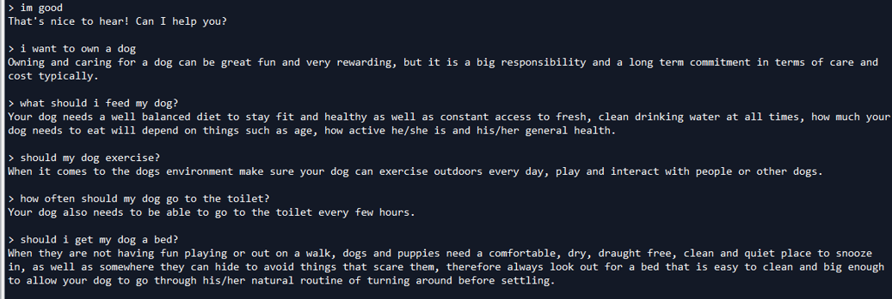
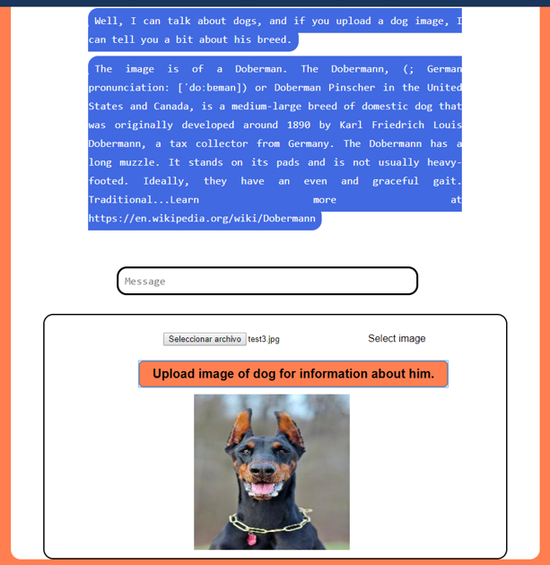
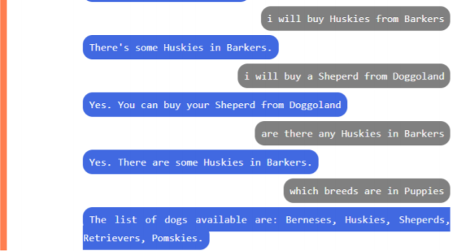
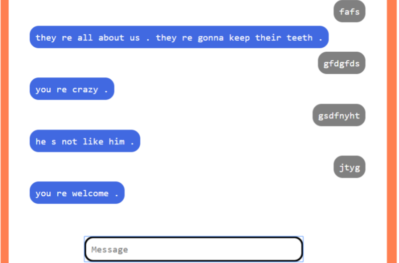
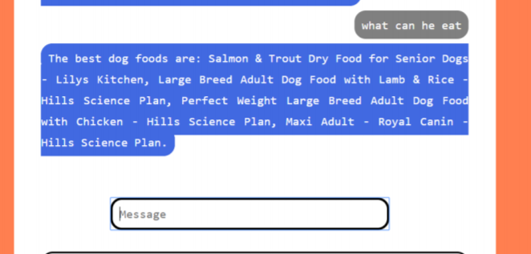

# Rule-Based-Chatbot
The chatbot was composed in 4 phases:  
Phase 1.0: Implements rules in the AIML file (the .xml file), and it implements a similarity-based component based on the bag-of-words model, tf/idf, and cosine similarity.  
 
  
 
Phase 2.0: Implements a pre-trained convolutional neural network that predicts the breed of the dog image that is provided.  
 

 
Phase 3.0: Implements NLTK based code that translates natural language sentences into first order logic, and does some reasoning based on its knowledge.  
 

 
Phase 4.0: Implements a pre-trained transformer network (https://www.tensorflow.org/tutorials/text/transformer) that predicts a reply sentence when the pattern input is not matched with any rule. Also implements a genetic algorithm that is used to calculate the name of the dog food that has the most protein percentage per money spent from a toy-world dataset.  
 

 
### Dataset for the image classification
Here you can download the original dataset: https://www.kaggle.com/jessicali9530/stanford-dogs-dataset  
You'll need it for being able to run the chatbot.
